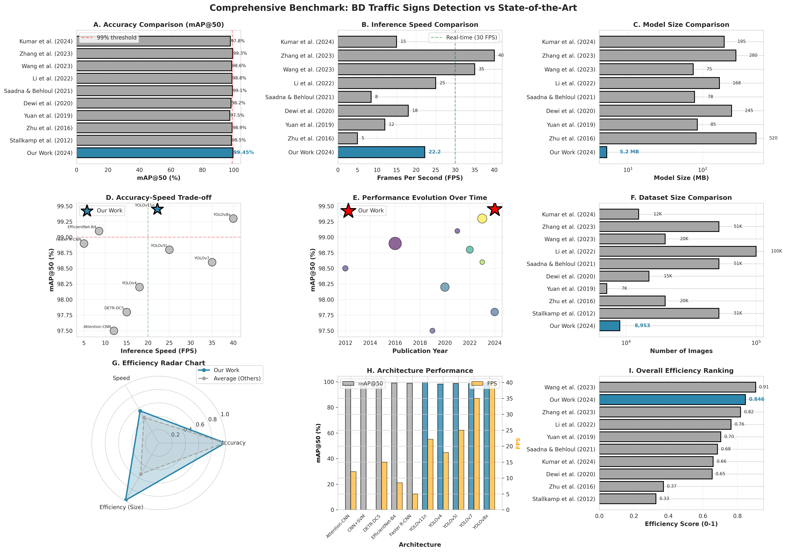

# BD Traffic Signs Research Website

**Professional research paper website for "Real-Time Bangladeshi Traffic Sign Detection Using Deep Learning: A Comparative Analysis of YOLOv11 and SSD Architectures"**

[](https://opensource.org/licenses/MIT)
[]()

## 📋 Overview

This is a professional, mobile-responsive static website showcasing the research project on Bangladeshi traffic sign detection. The website features:

- ✅ **Responsive Design** - Works perfectly on desktop, tablet, and mobile
- ✅ **Interactive Results Dashboard** - Tabbed interface for different result visualizations
- ✅ **PDF Paper Viewer** - Direct download links for research papers
- ✅ **Demo Integration** - Ready for Gradio app embedding
- ✅ **Dataset Information** - Comprehensive BRSDD dataset documentation
- ✅ **Citation Tools** - One-click BibTeX citation copying
- ✅ **Professional Design** - Bangladesh-inspired color scheme with academic focus

## 🗂️ Directory Structure

```
website/
├── index.html              # Main HTML file (single page)
├── css/
│   ├── style.css          # Main stylesheet
│   └── responsive.css     # Mobile/tablet responsive styles
├── js/
│   └── main.js            # Interactive features and navigation
├── assets/
│   ├── images/            # Result figures and visualizations
│   │   ├── figure_benchmark_comparison.png
│   │   ├── figure_training_metrics.png
│   │   ├── figure_model_comparison.png
│   │   ├── figure_complete_results.png
│   │   ├── figure_class_distribution.jpg
│   │   └── figure_training_samples.jpg
│   └── papers/            # Research papers (PDFs)
│       ├── RESEARCH_PAPER.pdf
│       ├── PREPRINT.pdf
│       └── CSE_499B_FINAL_REPORT.pdf
└── README.md              # This file
```

## 🚀 Quick Start

### Option 1: Local Testing

Simply open `index.html` in your web browser:

```bash
cd website
# On macOS
open index.html

# On Linux
xdg-open index.html

# On Windows
start index.html
```

Or use a simple HTTP server:

```bash
# Python 3
python -m http.server 8000

# Python 2
python -m SimpleHTTPServer 8000

# Node.js (with http-server package)
npx http-server

# PHP
php -S localhost:8000
```

Then visit: `http://localhost:8000`

### Option 2: Deploy to GitHub Pages

**Step 1: Create GitHub Repository**

```bash
cd /home/mnx/bd-traffic-signs
git init
git add website/
git commit -m "Add research website"
git branch -M main
git remote add origin https://github.com/your-username/bd-traffic-signs.git
git push -u origin main
```

**Step 2: Enable GitHub Pages**

1. Go to your repository on GitHub
2. Click **Settings** > **Pages**
3. Under "Source", select **main** branch
4. Select **/ (root)** folder
5. Click **Save**

**Step 3: Update Path (if using subdirectory)**

If you want to serve from the `website/` folder:
- In Settings > Pages, select **/website** folder instead of root
- Or move all files from `website/` to repository root

Your site will be live at: `https://your-username.github.io/bd-traffic-signs/`

### Option 3: Deploy to Netlify

**Method A: Drag and Drop (Easiest)**

1. Go to [netlify.com](https://netlify.com)
2. Drag and drop the `website` folder onto Netlify
3. Your site is live instantly!

**Method B: Git Integration**

1. Push code to GitHub (see above)
2. On Netlify, click "New site from Git"
3. Connect your repository
4. Build settings:
   - **Build command:** (leave empty)
   - **Publish directory:** `website`
5. Click "Deploy site"

**Custom Domain (Optional):**
- Settings > Domain management > Add custom domain
- Follow DNS configuration instructions

## 📝 Customization Guide

### 1. Update GitHub Repository Links

In `index.html`, search and replace:
```html
https://github.com/your-username/bd-traffic-signs
```
With your actual GitHub username.

### 2. Update Contact Information

In `index.html`, find the Contact section and update:
```html
<a href="mailto:your.email@example.com">
<a href="https://github.com/your-username">
<a href="https://linkedin.com/in/your-profile">
```

### 3. Add Gradio Demo

**Option A: Embed Existing Gradio App**

If you have a running Gradio app (e.g., on HuggingFace Spaces):

```html
<!-- Replace the demo-placeholder div in index.html -->
<iframe 
    src="https://your-username-your-space.hf.space" 
    frameborder="0" 
    width="100%" 
    height="600px"
    style="border-radius: 8px;"
></iframe>
```

**Option B: Deploy to HuggingFace Spaces**

1. Create a Space on [huggingface.co/spaces](https://huggingface.co/spaces)
2. Upload your `app.py` and model files
3. Copy the Space URL and embed it (see Option A)

### 4. Update Colors (Optional)

In `css/style.css`, modify the CSS variables:

```css
:root {
    --primary-color: #006A4E;      /* Your primary color */
    --secondary-color: #F42A41;    /* Your secondary color */
    --accent-color: #FFB800;        /* Your accent color */
}
```

### 5. Add Google Analytics (Optional)

Add before `</head>` in `index.html`:

```html
<!-- Google Analytics -->
<script async src="https://www.googletagmanager.com/gtag/js?id=YOUR-GA-ID"></script>
<script>
  window.dataLayer = window.dataLayer || [];
  function gtag(){dataLayer.push(arguments);}
  gtag('js', new Date());
  gtag('config', 'YOUR-GA-ID');
</script>
```

## 🔧 Advanced Configuration

### Add Custom Domain (GitHub Pages)

1. Buy a domain (e.g., from Namecheap, GoDaddy)
2. Add `CNAME` file to repository root:
   ```
   yourwebsite.com
   ```
3. Configure DNS records:
   ```
   Type: A
   Name: @
   Value: 185.199.108.153
   Value: 185.199.109.153
   Value: 185.199.110.153
   Value: 185.199.111.153
   
   Type: CNAME
   Name: www
   Value: your-username.github.io
   ```
4. In GitHub Settings > Pages, enter custom domain

### Enable HTTPS

GitHub Pages automatically provides HTTPS. For Netlify, it's also automatic.

### Performance Optimization

The website is already optimized with:
- ✅ Lazy loading images
- ✅ Minified CSS (can be further compressed)
- ✅ Efficient JavaScript
- ✅ Mobile-first responsive design

**Further optimizations:**

1. **Compress Images:**
   ```bash
   # Install ImageMagick
   cd assets/images
   
   # Compress PNG files
   for img in *.png; do
       convert "$img" -quality 85 -strip "opt_$img"
   done
   
   # Compress JPG files
   for img in *.jpg; do
       convert "$img" -quality 85 -strip "opt_$img"
   done
   ```

2. **Minify CSS/JS:**
   ```bash
   # Using online tools or npm packages
   npm install -g clean-css-cli uglify-js
   
   cleancss -o css/style.min.css css/style.css css/responsive.css
   uglifyjs js/main.js -o js/main.min.js -c -m
   ```
   
   Then update `index.html` to use minified versions.

3. **Enable CDN:**
   - Netlify provides CDN automatically
   - For GitHub Pages, consider using Cloudflare

## 🎨 Features Overview

### 1. Hero Section
- Project title and badges
- Key achievement metrics (mAP, model size, FPS)
- Call-to-action buttons
- Smooth scroll indicator

### 2. Abstract & Highlights
- Research overview
- Key contributions
- 6-card highlight grid with hover effects

### 3. Results Dashboard
- Tabbed interface for different visualizations
- Benchmark comparison table
- Training metrics
- Model comparison

### 4. Interactive Demo
- Web demo section (ready for Gradio embed)
- Android app information
- Sample detection results

### 5. Paper Section
- PDF download links for all papers
- Paper metadata (size, pages)
- Abstract preview

### 6. Dataset Section
- BRSDD statistics
- Class distribution visualization
- Data augmentation details
- Dataset download/access information

### 7. Citation
- BibTeX formatted citation
- One-click copy functionality
- Links to GitHub, arXiv, etc.

### 8. Contact
- Author information
- Faculty advisor details
- Acknowledgments
- Social media links

## 📱 Mobile Responsiveness

The website is fully responsive with breakpoints at:
- **1440px+**: Large desktop
- **1024px - 1440px**: Desktop
- **768px - 1024px**: Tablet
- **480px - 768px**: Mobile landscape
- **< 480px**: Mobile portrait

## ♿ Accessibility

The website follows WCAG 2.1 guidelines:
- ✅ Semantic HTML5 elements
- ✅ ARIA labels where appropriate
- ✅ Keyboard navigation support
- ✅ High contrast ratios
- ✅ Skip to content link
- ✅ Alt text for images
- ✅ Reduced motion support

## 🐛 Troubleshooting

### Issue: Images not loading

**Solution:** Check that image paths are correct relative to `index.html`:
```html
<!-- Correct -->


<!-- Incorrect -->

```

### Issue: CSS not applying

**Solution:** Clear browser cache (Ctrl+Shift+R) or check CSS file paths.

### Issue: Mobile menu not working

**Solution:** Ensure JavaScript is enabled and `js/main.js` is loading correctly.

### Issue: GitHub Pages not deploying

**Solution:** 
1. Check that repository is public (or you have GitHub Pro)
2. Ensure Pages is enabled in Settings
3. Wait 5-10 minutes for first deployment
4. Check Actions tab for build errors

## 📄 License

- **Website Code:** MIT License
- **Research Paper:** © 2024 Mohammad Mansib Newaz
- **Dataset:** CC BY 4.0

## 🤝 Credits

**Author:** Mohammad Mansib Newaz (ID: 1931842642)  
**Advisor:** Dr. Nabeel Mohammed  
**Institution:** North South University, Dhaka, Bangladesh  
**Project:** CSE 499B Senior Design Project (Fall 2024)

**Technologies Used:**
- HTML5, CSS3, Vanilla JavaScript
- Google Fonts (Inter, Roboto Mono)
- Font Awesome Icons
- GitHub Pages / Netlify

## 📧 Support

For issues or questions:
- **Email:** your.email@example.com
- **GitHub Issues:** [github.com/your-username/bd-traffic-signs/issues](https://github.com/your-username/bd-traffic-signs/issues)

---

Made with ❤️ for the Bangladeshi AI Community

**Last Updated:** February 2026
